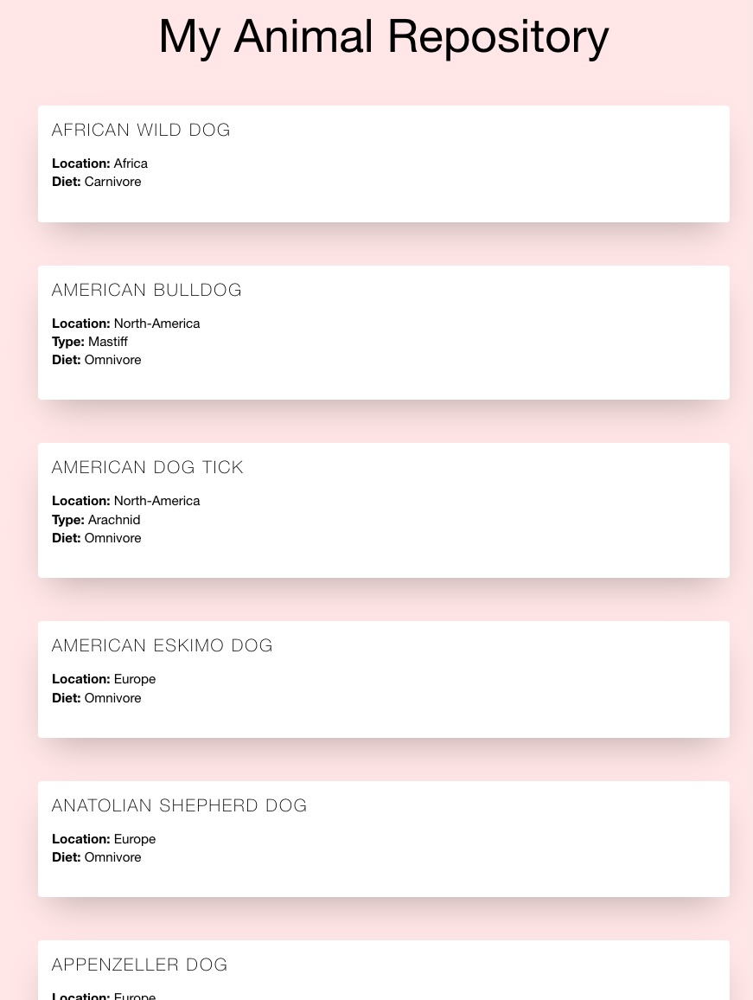
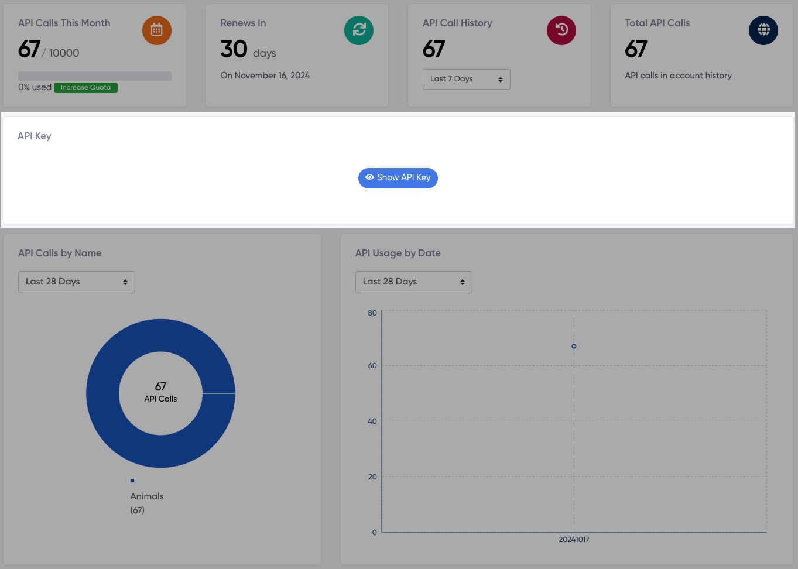

# Zootopia


Small cli script to search for animals and list them in a simple html file. Animal infos are fetched with [Animals API](https://api-ninjas.com/api/animals) from [API Ninjas](https://api-ninjas.com/).

## Installation

To install this project, just clone the repository and install all the dependencies in requirements.txt using `pip install -r requirements.txt`.

## Usage

To run the script, you will need a free [API Ninjas-Account](https://api-ninjas.com/) for the api-key.

### Get API key



### Set API key to script

Create an `.env` file and paste your API key into that file:

```py
API_KEY = "your_api_key_here"
```

### Run the script

- `python main.py` on windows and linux
- `python3 main.py` on mac

## Contributing

Contributions are welcome!

`animals_template.html` html template with general structure

- modify design to your likings:

- "\_\_REPLACE_ANIMALS_INFO\_\_" is a placeholder for the fetched content. Move it but if you want but don´t change it.

`data-fetcher.py` is only used to get the API data

- modifications are not recommended

`main.py` main script:

- `get_animal_specs` function to get all specs:

  - add, remove or modify the specs

- `get_html_serialization` function to serialize the specs to html
  - output of this function is replaced with placeholder in `animals-template.html`
  - modify to your likings
